# Design Document: Daily Engagement & Assessment System

## Overview

The Daily Engagement & Assessment System is a comprehensive feature that drives student accountability and consistent practice through multiple engagement mechanisms. The system ensures students actively use the MicroTrainer platform through technology-specific daily mini-assessments, real-time status tracking, browser notifications, email reminders, streak tracking, gamification, and performance analytics.

**Core Principle**: Every assessment is directly tied to the specific technology the student is actively learning. If a student studies JavaScript today, they take a JavaScript assessment. If they complete a Python concept, they get a Python mini-mock. No generic assessments - everything is targeted and relevant to their current learning path.

**Key Design Principles:**
- **Technology-Specific Assessments**: All mini-assessments and mock tests are generated from the exact technology the student is learning
- **Real-Time Updates**: Student status and activity updates happen immediately using WebSocket connections
- **Scalable Architecture**: Designed to handle thousands of concurrent students with efficient database queries and caching
- **Reliable Notifications**: Queue-based notification system ensures delivery even under high load
- **Data-Driven Insights**: Comprehensive analytics for both students and administrators
- **Privacy-First**: Secure handling of student data with GDPR compliance

**Scope:**
- Backend APIs for engagement tracking, notifications, assessments, and analytics
- Real-time WebSocket system for live status updates
- Database schema for engagement data, streaks, badges, and status history
- Frontend components for student dashboard and admin monitoring
- Integration with existing Learning Path and Interview systems
- Cron jobs for scheduled tasks (daily assessments, streak calculations, email reminders)
- Email service integration for reminders and progress reports
- Excel/CSV export functionality for progress sheets

**Out of Scope:**
- Mobile native applications (browser notifications on mobile web only)
- SMS notifications (email and browser notifications only)
- Video content or multimedia assessments
- Peer-to-peer features or social networking
- Payment or subscription management

## Architecture

### System Architecture

```mermaid
graph TB
    subgraph "Frontend (React)"
        StudentDash[Student Dashboard]
        AdminDash[Admin Dashboard]
        RealTimeDash[Real-Time Status Display]
        AnalyticsDash[Performance Analytics]
        NotifPrefs[Notification Preferences]
    end
    
    subgraph "WebSocket Layer"
        WSServer[WebSocket Server - Socket.io]
        WSManager[Connection Manager]
        EventBroadcaster[Event Broadcaster]
    end
    
    subgraph "Backend APIs (Node.js/Express)"
        EngagementAPI[Engagement API]
        AssessmentAPI[Assessment API]
        NotificationAPI[Notification API]
        AnalyticsAPI[Analytics API]
        ExportAPI[Export API]
    end
    
    subgraph "Background Jobs (Cron)"
        DailyAssessmentJob[Daily Assessment Generator]
        StreakCalculatorJob[Streak Calculator]
        EmailSchedulerJob[Email Scheduler]
        StatusUpdateJob[Status Update Job]
        ProgressSheetJob[Progress Sheet Generator]
    end
    
    subgraph "External Services"
        EmailService[Email Service - SendGrid/AWS SES]
        BrowserNotif[Browser Notification API]
    end
    
    subgraph "Database (MongoDB)"
        EngagementDB[(Engagement Data)]
        AssessmentDB[(Assessments)]
        NotificationDB[(Notifications)]
        AnalyticsDB[(Analytics)]
    end
    
    subgraph "Existing Systems"
        LearningPath[Learning Path System]
        InterviewSystem[Interview System]
    end
    
    StudentDash --> WSServer
    AdminDash --> WSServer
    WSServer --> WSManager
    WSManager --> EventBroadcaster
    
    StudentDash --> EngagementAPI
    StudentDash --> AssessmentAPI
    AdminDash --> AnalyticsAPI
    AdminDash --> ExportAPI
    
    EngagementAPI --> EngagementDB
    AssessmentAPI --> AssessmentDB
    NotificationAPI --> NotificationDB
    AnalyticsAPI --> AnalyticsDB
    
    EngagementAPI --> EventBroadcaster
    AssessmentAPI --> EventBroadcaster
    
    EventBroadcaster --> WSServer
    
    DailyAssessmentJob --> AssessmentDB
    StreakCalculatorJob --> EngagementDB
    EmailSchedulerJob --> EmailService
    StatusUpdateJob --> EngagementDB
    ProgressSheetJob --> AnalyticsDB
    
    NotificationAPI --> EmailService
    NotificationAPI --> BrowserNotif
    
    AssessmentAPI --> LearningPath
    AssessmentAPI --> InterviewSystem
    
    ExportAPI --> AnalyticsDB
```




### Component Architecture

**Frontend Components:**
1. **Student Dashboard** - Real-time status, today's summary, streak tracker
2. **Admin Dashboard** - Live student monitoring, activity feed, filters
3. **Performance Analytics** - Graphs, trends, engagement score
4. **Notification Preferences** - Settings for browser and email notifications

**Backend Services:**
1. **Engagement Service** - Tracks student activity, calculates status
2. **Assessment Service** - Generates and scores mini-assessments and mock tests
3. **Notification Service** - Manages browser and email notifications
4. **Analytics Service** - Calculates metrics, generates reports
5. **Export Service** - Creates Excel/CSV progress sheets

**Real-Time System:**
1. **WebSocket Server** - Socket.io for bidirectional communication
2. **Connection Manager** - Handles client connections and rooms
3. **Event Broadcaster** - Publishes events to connected clients

**Background Jobs:**
1. **Daily Assessment Generator** - Runs at midnight UTC
2. **Streak Calculator** - Runs at midnight UTC
3. **Email Scheduler** - Runs hourly for scheduled emails
4. **Status Update Job** - Runs every 5 minutes
5. **Progress Sheet Generator** - Runs at midnight UTC

### Data Flow

**1. Student Completes Mini-Assessment Flow:**
```
Student submits assessment
  → POST /api/engagement/mini-assessment/submit
  → Assessment Service scores submission
  → Store result in AssessmentDB
  → Update student status in EngagementDB
  → Calculate new streak if applicable
  → Broadcast status update via WebSocket
  → Student dashboard updates in real-time
  → Admin dashboard shows activity in feed
  → Check if badge earned → Send notification
```

**2. Real-Time Status Update Flow:**
```
Activity completed
  → Engagement Service calculates new status
  → Persist to EngagementDB
  → Publish event to Event Broadcaster
  → Event Broadcaster sends to WebSocket Server
  → WebSocket Server broadcasts to:
    - Student's connected clients
    - Admin dashboard clients
  → UI updates without page refresh
```

**3. Daily Assessment Generation Flow:**
```
Midnight UTC
  → Cron job triggers Daily Assessment Generator
  → For each active student:
    - Fetch student's active Learning Path
    - Get current concept and previous concepts
    - Query question bank for technology
    - Generate 3-5 questions
    - Store in AssessmentDB with status "pending"
  → Log completion
```

**4. Email Reminder Flow:**
```
Email Scheduler Job runs hourly
  → Query students who haven't practiced in 24 hours
  → For each student:
    - Check notification preferences
    - Check if unsubscribed
    - Generate personalized email content
    - Queue email in NotificationDB
    - Send via Email Service
    - Track delivery status
```

**5. Progress Sheet Export Flow:**
```
Admin requests export
  → POST /api/analytics/export
  → Export Service queries AnalyticsDB
  → Aggregate data by date range
  → Generate Excel file using ExcelJS
  → Include charts and formatting
  → Return download link
  → Store file for 90 days
```

## Backend Design

### API Endpoints

#### Engagement API

**1. POST /api/engagement/activity**
- Records student activity (concept studied, time spent)
- Updates student status
- Broadcasts real-time update
```typescript
Request: {
  studentId: string;
  activityType: 'concept_study' | 'mini_assessment' | 'mock_test';
  technology: string;
  conceptId?: string;
  timeSpent: number; // minutes
}
Response: {
  status: 'Active' | 'Inactive' | 'At_Risk' | 'Excelling';
  todaySummary: {
    activitiesCompleted: number;
    timeSpent: number;
    assessmentsTaken: number;
    averageScore: number;
  };
}
```

**2. GET /api/engagement/status/:studentId**
- Retrieves current student status and today's summary
```typescript
Response: {
  status: 'Active' | 'Inactive' | 'At_Risk' | 'Excelling';
  streak: number;
  longestStreak: number;
  todaySummary: DailySummary;
  statusHistory: StatusHistory[];
}
```

**3. GET /api/engagement/streak/:studentId**
- Retrieves streak information
```typescript
Response: {
  currentStreak: number;
  longestStreak: number;
  streakAtRisk: boolean;
  lastPracticeDate: string;
  calendar: {
    date: string;
    practiced: boolean;
  }[];
}
```

**4. POST /api/engagement/streak/calculate**
- Manually triggers streak calculation (admin only)
```typescript
Request: {
  studentId?: string; // If omitted, calculates for all students
}
Response: {
  studentsProcessed: number;
  streaksUpdated: number;
}
```

#### Assessment API

**5. GET /api/assessment/mini-assessment/:studentId**
- Retrieves today's mini-assessment for student
```typescript
Response: {
  assessmentId: string;
  technology: string;
  questions: {
    id: string;
    question: string;
    type: 'multiple_choice' | 'code' | 'short_answer';
    options?: string[];
  }[];
  timeLimit: number; // minutes
  conceptsCovered: string[];
}
```

**6. POST /api/assessment/mini-assessment/submit**
- Submits mini-assessment answers
```typescript
Request: {
  assessmentId: string;
  studentId: string;
  answers: {
    questionId: string;
    answer: string;
  }[];
  timeSpent: number; // seconds
}
Response: {
  score: number;
  percentage: number;
  passed: boolean;
  feedback: string;
  weakAreas: string[];
  streakUpdated: boolean;
  badgeEarned?: {
    badgeId: string;
    name: string;
  };
}
```

**7. GET /api/assessment/mock-test/:studentId**
- Retrieves weekly mock test
```typescript
Query: {
  technology?: string; // If omitted, includes all practiced technologies
}
Response: {
  mockTestId: string;
  technologies: string[];
  questions: Question[];
  timeLimit: number;
  scheduledFor: string;
}
```

**8. POST /api/assessment/mock-test/submit**
- Submits mock test answers
```typescript
Request: {
  mockTestId: string;
  studentId: string;
  answers: Answer[];
}
Response: {
  score: number;
  percentage: number;
  technologyBreakdown: {
    technology: string;
    score: number;
    percentage: number;
  }[];
  weakTopics: string[];
  comparison: {
    previousScore?: number;
    improvement: number;
  };
}
```

**9. POST /api/assessment/generate**
- Generates technology-specific mini-mock on-demand
```typescript
Request: {
  studentId: string;
  technology: string;
  conceptIds?: string[]; // Specific concepts to test
}
Response: {
  assessmentId: string;
  questions: Question[];
}
```

#### Notification API

**10. POST /api/notification/send**
- Sends notification to student
```typescript
Request: {
  studentId: string;
  type: 'browser' | 'email' | 'both';
  category: 'reminder' | 'streak_alert' | 'progress_alert' | 'badge_earned';
  content: {
    title: string;
    message: string;
    actionUrl?: string;
  };
}
Response: {
  notificationId: string;
  sent: boolean;
  channels: string[];
}
```

**11. GET /api/notification/preferences/:studentId**
- Retrieves notification preferences
```typescript
Response: {
  browserEnabled: boolean;
  emailEnabled: boolean;
  frequency: 'daily' | 'every_2_days' | 'weekly';
  quietHours: {
    start: string; // HH:mm
    end: string;
  };
  types: {
    miniAssessmentReminders: boolean;
    streakAlerts: boolean;
    mockTestReminders: boolean;
    progressAlerts: boolean;
  };
}
```

**12. PUT /api/notification/preferences/:studentId**
- Updates notification preferences
```typescript
Request: NotificationPreferences
Response: {
  updated: boolean;
  preferences: NotificationPreferences;
}
```

#### Analytics API

**13. GET /api/analytics/dashboard/:studentId**
- Retrieves performance analytics for student dashboard
```typescript
Response: {
  engagementScore: number;
  todayActivity: {
    status: string;
    activitiesCompleted: number;
    timeSpent: number;
    score: number;
  };
  last30Days: {
    date: string;
    activitiesCompleted: number;
    timeSpent: number;
    averageScore: number;
  }[];
  topicsProgress: {
    technology: string;
    topicsMastered: number;
    totalTopics: number;
  }[];
  weakAreas: string[];
  upcomingMockTests: {
    date: string;
    technologies: string[];
  }[];
  badges: Badge[];
}
```

**14. GET /api/analytics/admin/students**
- Retrieves all students' current status for admin dashboard
```typescript
Query: {
  filter?: 'active_today' | 'inactive_today' | 'at_risk' | 'high_performers';
  sortBy?: 'last_activity' | 'streak' | 'score' | 'time_spent';
  limit?: number;
  offset?: number;
}
Response: {
  students: {
    studentId: string;
    name: string;
    status: string;
    lastActivity: string;
    todayActivities: number;
    currentStreak: number;
    todayScore: number;
    timeSpentToday: number;
  }[];
  aggregateMetrics: {
    totalActiveToday: number;
    averageEngagementScore: number;
    totalAssessmentsCompleted: number;
  };
}
```

**15. GET /api/analytics/admin/activity-feed**
- Retrieves real-time activity feed for admin dashboard
```typescript
Query: {
  limit?: number;
  since?: string; // ISO timestamp
}
Response: {
  activities: {
    studentId: string;
    studentName: string;
    action: string;
    technology: string;
    score?: number;
    timestamp: string;
  }[];
}
```

#### Export API

**16. POST /api/export/progress-sheet**
- Generates and exports progress sheet
```typescript
Request: {
  studentIds?: string[]; // If omitted, exports all students
  dateRange: {
    start: string;
    end: string;
  };
  format: 'xlsx' | 'csv';
  includeCharts: boolean;
}
Response: {
  exportId: string;
  downloadUrl: string;
  expiresAt: string;
  fileSize: number;
}
```

**17. GET /api/export/progress-sheet/:exportId**
- Downloads previously generated progress sheet
```typescript
Response: File (Excel or CSV)
```

### Database Schema

#### Collections/Tables

**1. students_engagement**
```typescript
{
  _id: ObjectId,
  studentId: string (indexed),
  currentStatus: 'Active' | 'Inactive' | 'At_Risk' | 'Excelling',
  currentStreak: number,
  longestStreak: number,
  lastPracticeDate: Date,
  engagementScore: number,
  activeTechnology: string,
  createdAt: Date,
  updatedAt: Date
}
```

**2. daily_activities**
```typescript
{
  _id: ObjectId,
  studentId: string (indexed),
  date: Date (indexed),
  activities: [{
    type: 'concept_study' | 'mini_assessment' | 'mock_test',
    technology: string,
    conceptId: string,
    timeSpent: number,
    score: number,
    timestamp: Date
  }],
  totalTimeSpent: number,
  totalActivities: number,
  averageScore: number,
  technologiesPracticed: string[],
  status: string,
  createdAt: Date
}
```

**3. mini_assessments**
```typescript
{
  _id: ObjectId,
  assessmentId: string (indexed),
  studentId: string (indexed),
  technology: string (indexed),
  generatedDate: Date,
  status: 'pending' | 'in_progress' | 'completed',
  questions: [{
    questionId: string,
    question: string,
    type: string,
    options: string[],
    correctAnswer: string,
    conceptId: string
  }],
  submission: {
    answers: [{
      questionId: string,
      answer: string
    }],
    submittedAt: Date,
    timeSpent: number
  },
  result: {
    score: number,
    percentage: number,
    passed: boolean,
    weakAreas: string[]
  },
  createdAt: Date,
  updatedAt: Date
}
```

**4. mock_tests**
```typescript
{
  _id: ObjectId,
  mockTestId: string (indexed),
  studentId: string (indexed),
  scheduledDate: Date,
  technologies: string[],
  questions: Question[],
  status: 'scheduled' | 'in_progress' | 'completed',
  submission: {
    answers: Answer[],
    submittedAt: Date
  },
  result: {
    overallScore: number,
    overallPercentage: number,
    technologyBreakdown: [{
      technology: string,
      score: number,
      percentage: number
    }],
    weakTopics: string[],
    comparison: {
      previousScore: number,
      improvement: number
    }
  },
  createdAt: Date,
  updatedAt: Date
}
```

**5. streaks**
```typescript
{
  _id: ObjectId,
  studentId: string (indexed, unique),
  currentStreak: number,
  longestStreak: number,
  lastPracticeDate: Date,
  streakHistory: [{
    date: Date,
    practiced: boolean,
    activitiesCompleted: number
  }],
  streakAtRisk: boolean,
  updatedAt: Date
}
```

**6. badges**
```typescript
{
  _id: ObjectId,
  studentId: string (indexed),
  badgeId: string,
  badgeName: string,
  badgeType: 'streak' | 'score' | 'completion',
  earnedAt: Date,
  criteria: {
    type: string,
    value: number
  }
}
```

**7. notifications**
```typescript
{
  _id: ObjectId,
  notificationId: string (indexed),
  studentId: string (indexed),
  type: 'browser' | 'email',
  category: string,
  content: {
    title: string,
    message: string,
    actionUrl: string
  },
  status: 'pending' | 'sent' | 'failed',
  scheduledFor: Date,
  sentAt: Date,
  opened: boolean,
  openedAt: Date,
  createdAt: Date
}
```

**8. notification_preferences**
```typescript
{
  _id: ObjectId,
  studentId: string (indexed, unique),
  browserEnabled: boolean,
  emailEnabled: boolean,
  frequency: string,
  quietHours: {
    start: string,
    end: string
  },
  types: {
    miniAssessmentReminders: boolean,
    streakAlerts: boolean,
    mockTestReminders: boolean,
    progressAlerts: boolean
  },
  optimalTime: {
    hour: number,
    minute: number,
    timezone: string
  },
  unsubscribed: boolean,
  updatedAt: Date
}
```

**9. status_history**
```typescript
{
  _id: ObjectId,
  studentId: string (indexed),
  date: Date (indexed),
  status: string,
  activitiesCompleted: number,
  scores: number[],
  timeSpent: number,
  technologiesPracticed: string[],
  engagementScore: number,
  createdAt: Date
}
```

**10. progress_sheets**
```typescript
{
  _id: ObjectId,
  exportId: string (indexed),
  generatedBy: string, // admin user ID
  studentIds: string[],
  dateRange: {
    start: Date,
    end: Date
  },
  format: string,
  fileUrl: string,
  fileSize: number,
  expiresAt: Date,
  createdAt: Date
}
```

### Database Indexes

```javascript
// Performance optimization indexes
db.students_engagement.createIndex({ studentId: 1 });
db.daily_activities.createIndex({ studentId: 1, date: -1 });
db.mini_assessments.createIndex({ studentId: 1, generatedDate: -1 });
db.mini_assessments.createIndex({ technology: 1, status: 1 });
db.mock_tests.createIndex({ studentId: 1, scheduledDate: -1 });
db.streaks.createIndex({ studentId: 1 }, { unique: true });
db.badges.createIndex({ studentId: 1, earnedAt: -1 });
db.notifications.createIndex({ studentId: 1, scheduledFor: 1 });
db.notification_preferences.createIndex({ studentId: 1 }, { unique: true });
db.status_history.createIndex({ studentId: 1, date: -1 });
db.progress_sheets.createIndex({ exportId: 1 }, { unique: true });
```


## Frontend Design

### Component Hierarchy

```
App
├── StudentDashboard
│   ├── StatusBanner (Real-time status indicator)
│   ├── TodaysSummary
│   │   ├── ActivityCount
│   │   ├── TimeSpent
│   │   ├── AverageScore
│   │   └── TechnologiesPracticed
│   ├── StreakTracker
│   │   ├── CurrentStreak
│   │   ├── LongestStreak
│   │   └── Calendar (30-day view)
│   ├── MiniAssessmentCard
│   │   ├── TechnologyBadge
│   │   ├── QuestionCount
│   │   └── StartButton
│   ├── PerformanceAnalytics
│   │   ├── EngagementScore
│   │   ├── Last30DaysGraph
│   │   ├── WeakAreasPanel
│   │   └── ComparisonMetrics
│   ├── BadgeDisplay
│   │   ├── EarnedBadges
│   │   └── NextBadgeProgress
│   └── UpcomingMockTests
│
├── AdminDashboard
│   ├── AggregateMetrics
│   │   ├── TotalActiveToday
│   │   ├── AverageEngagementScore
│   │   └── TotalAssessmentsCompleted
│   ├── StudentListView
│   │   ├── FilterBar (Active/Inactive/At Risk/High Performers)
│   │   ├── SortControls
│   │   └── StudentCards
│   │       ├── StatusIndicator (Live)
│   │       ├── LastActivity
│   │       ├── TodayMetrics
│   │       └── ExpandButton
│   ├── ActivityFeed (Real-time)
│   │   └── ActivityItems
│   │       ├── StudentName
│   │       ├── ActionType
│   │       ├── Technology
│   │       ├── Score
│   │       └── Timestamp
│   ├── StudentDetailModal
│   │   ├── TodayActivities
│   │   ├── TechnologiesStudied
│   │   ├── ConceptsCompleted
│   │   ├── AssessmentScores
│   │   └── TimeBreakdown
│   └── ExportControls
│       ├── DateRangePicker
│       ├── StudentSelector
│       ├── FormatSelector
│       └── ExportButton
│
└── NotificationPreferences
    ├── BrowserNotificationToggle
    ├── EmailNotificationToggle
    ├── FrequencySelector
    ├── QuietHoursConfig
    └── NotificationTypeToggles
```

### State Management

**Global State (React Context or Redux):**
```typescript
interface GlobalState {
  user: {
    studentId: string;
    name: string;
    email: string;
    timezone: string;
  };
  engagement: {
    status: 'Active' | 'Inactive' | 'At_Risk' | 'Excelling';
    streak: number;
    longestStreak: number;
    engagementScore: number;
    todaySummary: DailySummary;
  };
  realTime: {
    connected: boolean;
    lastUpdate: string;
  };
  notifications: {
    unreadCount: number;
    preferences: NotificationPreferences;
  };
}
```

**WebSocket State:**
```typescript
interface WebSocketState {
  socket: Socket | null;
  connected: boolean;
  reconnecting: boolean;
  events: {
    statusUpdate: (data: StatusUpdate) => void;
    activityCompleted: (data: Activity) => void;
    badgeEarned: (data: Badge) => void;
    streakUpdated: (data: Streak) => void;
  };
}
```

### UI/UX Layouts

**Student Dashboard - Today's Summary:**
```
┌─────────────────────────────────────────────────────────┐
│  Status: 🟢 Active                    Streak: 🔥 12 days │
├─────────────────────────────────────────────────────────┤
│  Today's Summary                                         │
│  ┌──────────┐ ┌──────────┐ ┌──────────┐ ┌──────────┐  │
│  │    3     │ │  45 min  │ │   85%    │ │JavaScript│  │
│  │Activities│ │Time Spent│ │Avg Score │ │  Python  │  │
│  └──────────┘ └──────────┘ └──────────┘ └──────────┘  │
├─────────────────────────────────────────────────────────┤
│  📝 Today's Mini-Assessment                             │
│  Technology: JavaScript                                  │
│  Questions: 5 | Time: ~10 minutes                       │
│  Topics: Arrays, Functions, Objects                     │
│  [Start Assessment]                                      │
├─────────────────────────────────────────────────────────┤
│  📊 Your Progress                                       │
│  Engagement Score: 87/100                               │
│  ▓▓▓▓▓▓▓▓▓▓▓▓▓▓▓▓▓░░░                                 │
│  Last 30 Days Activity:                                 │
│  [Graph showing daily activity]                         │
└─────────────────────────────────────────────────────────┘
```

**Admin Dashboard - Live Monitoring:**
```
┌─────────────────────────────────────────────────────────┐
│  📊 Today's Metrics                                     │
│  Active Students: 245 | Avg Engagement: 78 | Tests: 892│
├─────────────────────────────────────────────────────────┤
│  Filters: [All] [Active Today] [At Risk] [High Perf]   │
│  Sort by: [Last Activity ▼]                            │
├─────────────────────────────────────────────────────────┤
│  🟢 John Doe          | Last: 2 min ago | Streak: 15   │
│     Today: 3 activities | Score: 92% | Time: 45 min    │
│     [View Details]                                      │
├─────────────────────────────────────────────────────────┤
│  🔴 Jane Smith        | Last: 3 days ago | Streak: 0   │
│     Status: At Risk | No activity today                │
│     [View Details]                                      │
├─────────────────────────────────────────────────────────┤
│  🔴 Live Activity Feed                                  │
│  • John completed JavaScript Mini-Assessment - 85% - now│
│  • Sarah completed Python concept - 2 min ago          │
│  • Mike earned "Week Warrior" badge - 5 min ago        │
└─────────────────────────────────────────────────────────┘
```

## Real-Time System Design

### WebSocket Architecture

**Technology Choice:** Socket.io
- Bidirectional communication
- Automatic reconnection
- Room-based broadcasting
- Fallback to long-polling

**Connection Management:**
```typescript
// Server-side
io.on('connection', (socket) => {
  const { studentId, role } = socket.handshake.auth;
  
  if (role === 'student') {
    socket.join(`student:${studentId}`);
  } else if (role === 'admin') {
    socket.join('admin');
  }
  
  socket.on('disconnect', () => {
    // Handle cleanup
  });
});
```

**Event Types:**
```typescript
// Student events
'status:update' - Student status changed
'activity:completed' - Activity completed
'streak:updated' - Streak count changed
'badge:earned' - New badge earned
'assessment:available' - New assessment ready

// Admin events
'student:activity' - Any student activity
'student:status_change' - Student status changed
'alert:at_risk' - Student became at risk
```

**Broadcasting Strategy:**
```typescript
// Broadcast to specific student
io.to(`student:${studentId}`).emit('status:update', statusData);

// Broadcast to all admins
io.to('admin').emit('student:activity', activityData);

// Broadcast to student and admins
io.to(`student:${studentId}`).to('admin').emit('activity:completed', data);
```

**Client-Side Connection:**
```typescript
import { io } from 'socket.io-client';

const socket = io('http://localhost:5000', {
  auth: {
    studentId: user.studentId,
    role: user.role,
    token: authToken
  },
  reconnection: true,
  reconnectionDelay: 1000,
  reconnectionAttempts: 5
});

socket.on('connect', () => {
  console.log('Connected to real-time server');
});

socket.on('status:update', (data) => {
  updateStudentStatus(data);
});

socket.on('disconnect', () => {
  console.log('Disconnected from real-time server');
});
```

### Real-Time Update Flow

**1. Activity Completion:**
```
Student completes mini-assessment
  → Frontend: POST /api/assessment/mini-assessment/submit
  → Backend: Score assessment
  → Backend: Update database
  → Backend: Calculate new status
  → Backend: Emit 'activity:completed' event
  → WebSocket Server: Broadcast to student's room
  → WebSocket Server: Broadcast to admin room
  → Frontend (Student): Update dashboard without refresh
  → Frontend (Admin): Add to activity feed
```

**2. Status Change:**
```
Status calculation determines change
  → Backend: Update status in database
  → Backend: Emit 'status:update' event
  → WebSocket Server: Broadcast to student
  → Frontend: Update status banner
  → Frontend: Show notification if status is "At Risk"
```

**3. Badge Earned:**
```
Streak reaches milestone
  → Backend: Award badge
  → Backend: Store in badges collection
  → Backend: Emit 'badge:earned' event
  → WebSocket Server: Broadcast to student
  → Frontend: Show badge animation
  → Frontend: Update badge display
  → Backend: Send congratulatory notification
```

## Integration Points

### Learning Path System Integration

**Data Flow:**
```
Student completes concept in Learning Path
  → Learning Path System: Mark concept complete
  → Learning Path System: Call Engagement API
  → POST /api/engagement/activity
  → Engagement System: Record activity
  → Engagement System: Generate technology-specific mini-mock
  → Engagement System: Send notification
```

**API Integration:**
```typescript
// Engagement system queries Learning Path
GET /api/learning-path/progress/:studentId/:technology
Response: {
  currentConceptOrder: number;
  completedConcepts: string[];
  conceptScores: { [conceptId]: number };
}

// Use this data to generate targeted assessments
const assessment = generateMiniAssessment({
  technology,
  concepts: completedConcepts,
  weakConcepts: conceptsWithLowScores
});
```

### Interview System Integration

**Scoring Algorithm:**
```typescript
// Use Interview System's scoring for mock tests
import { calculateScore } from '../interview-system/scoring';

const mockTestScore = calculateScore({
  answers: studentAnswers,
  correctAnswers: mockTest.correctAnswers,
  difficulty: mockTest.difficulty
});
```

**Question Bank:**
```typescript
// Reuse Interview System's question bank
import { getQuestions } from '../interview-system/questions';

const questions = getQuestions({
  technology: 'javascript',
  topics: ['arrays', 'functions'],
  difficulty: studentLevel,
  count: 5
});
```

### Email Service Integration

**Service Choice:** SendGrid or AWS SES

**SendGrid Integration:**
```typescript
import sgMail from '@sendgrid/mail';

sgMail.setApiKey(process.env.SENDGRID_API_KEY);

async function sendEmail(to: string, template: string, data: any) {
  const msg = {
    to,
    from: 'noreply@microtrainer.com',
    templateId: template,
    dynamicTemplateData: data
  };
  
  await sgMail.send(msg);
}
```

**Email Templates:**
1. **Daily Reminder** - "You haven't practiced today"
2. **Weekly Summary** - Progress report with charts
3. **Streak Congratulations** - Milestone achievements
4. **At Risk Alert** - Inactivity warning
5. **Mock Test Reminder** - Upcoming test notification

## Technical Stack

### Backend
- **Runtime:** Node.js 18+
- **Framework:** Express.js
- **Database:** MongoDB with Mongoose
- **WebSocket:** Socket.io
- **Cron Jobs:** node-cron or Agenda
- **Email:** SendGrid SDK or AWS SES SDK
- **Excel Export:** ExcelJS
- **Authentication:** JWT (existing system)

### Frontend
- **Framework:** React 18+
- **State Management:** React Context API or Redux Toolkit
- **WebSocket Client:** socket.io-client
- **Charts:** Chart.js or Recharts
- **UI Components:** Tailwind CSS (existing)
- **Animations:** Framer Motion (existing)
- **Date Handling:** date-fns or Day.js

### DevOps
- **Hosting:** Same as existing backend
- **WebSocket:** Separate Socket.io server or same Express server
- **Database:** MongoDB Atlas or self-hosted
- **Email Service:** SendGrid or AWS SES
- **File Storage:** AWS S3 for progress sheets
- **Monitoring:** PM2 for process management

## Implementation Strategy

### Phase 1: Core Engagement Tracking (Week 1-2)
**Priority:** High
**Dependencies:** None

**Tasks:**
1. Create database schema and collections
2. Implement Engagement API endpoints
3. Build basic student dashboard
4. Implement activity tracking
5. Create status calculation logic
6. Test with sample data

**Deliverables:**
- Working engagement tracking
- Student can see today's summary
- Status updates correctly

### Phase 2: Assessments & Streak System (Week 3-4)
**Priority:** High
**Dependencies:** Phase 1

**Tasks:**
1. Implement Assessment API endpoints
2. Create mini-assessment generator
3. Build assessment UI components
4. Implement streak calculation logic
5. Create streak tracker UI
6. Set up daily cron job for assessment generation
7. Set up midnight cron job for streak calculation

**Deliverables:**
- Students can take mini-assessments
- Streak tracking works correctly
- Daily assessments generated automatically

### Phase 3: Real-Time System (Week 5)
**Priority:** High
**Dependencies:** Phase 1, 2

**Tasks:**
1. Set up Socket.io server
2. Implement WebSocket connection management
3. Create event broadcasting system
4. Integrate WebSocket with frontend
5. Test real-time updates
6. Handle reconnection scenarios

**Deliverables:**
- Real-time status updates
- Live dashboard for students
- No page refresh needed

### Phase 4: Notifications (Week 6)
**Priority:** Medium
**Dependencies:** Phase 2

**Tasks:**
1. Integrate email service (SendGrid/AWS SES)
2. Create email templates
3. Implement Notification API
4. Build browser notification system
5. Create notification preferences UI
6. Set up email scheduler cron job
7. Implement optimal time calculation

**Deliverables:**
- Browser notifications working
- Email reminders sending
- Students can configure preferences

### Phase 5: Admin Dashboard (Week 7)
**Priority:** Medium
**Dependencies:** Phase 3

**Tasks:**
1. Build admin dashboard UI
2. Implement Analytics API for admin
3. Create real-time activity feed
4. Add filters and sorting
5. Build student detail modal
6. Test with multiple students

**Deliverables:**
- Admin can monitor all students
- Real-time activity feed
- Filters and sorting work

### Phase 6: Mock Tests & Gamification (Week 8)
**Priority:** Medium
**Dependencies:** Phase 2

**Tasks:**
1. Implement mock test generation
2. Create mock test UI
3. Implement badge system
4. Create badge display UI
5. Set up weekly mock test scheduler
6. Test mock test flow

**Deliverables:**
- Weekly mock tests scheduled
- Students can take mock tests
- Badges awarded correctly

### Phase 7: Analytics & Export (Week 9)
**Priority:** Low
**Dependencies:** Phase 5

**Tasks:**
1. Implement performance analytics
2. Create analytics dashboard UI
3. Build export functionality (Excel/CSV)
4. Create progress sheet templates
5. Set up automated daily export
6. Test export with large datasets

**Deliverables:**
- Performance analytics working
- Progress sheets exportable
- Charts and trends display correctly

### Phase 8: Testing & Optimization (Week 10)
**Priority:** High
**Dependencies:** All phases

**Tasks:**
1. End-to-end testing
2. Performance optimization
3. Load testing (1000+ concurrent users)
4. Security audit
5. Bug fixes
6. Documentation

**Deliverables:**
- System tested and stable
- Performance optimized
- Documentation complete

## Testing Strategy

### Unit Tests
- API endpoint tests (Jest + Supertest)
- Service layer tests
- Database query tests
- WebSocket event tests
- Utility function tests

### Integration Tests
- Complete user flows
- API integration tests
- Database integration tests
- Email service integration tests
- WebSocket integration tests

### End-to-End Tests
- Student completes assessment flow
- Streak tracking flow
- Real-time update flow
- Admin monitoring flow
- Export generation flow

### Performance Tests
- Load testing with Artillery or k6
- Database query performance
- WebSocket connection limits
- Concurrent user handling
- Memory leak detection

### Security Tests
- Authentication tests
- Authorization tests
- Input validation tests
- SQL/NoSQL injection tests
- XSS prevention tests

## Deployment Considerations

### Environment Variables
```
# Database
MONGODB_URI=mongodb://localhost:27017/microtrainer
MONGODB_TEST_URI=mongodb://localhost:27017/microtrainer_test

# WebSocket
WEBSOCKET_PORT=5001
WEBSOCKET_CORS_ORIGIN=http://localhost:3000

# Email Service
SENDGRID_API_KEY=your_sendgrid_key
EMAIL_FROM=noreply@microtrainer.com

# Cron Jobs
ENABLE_CRON_JOBS=true
DAILY_ASSESSMENT_TIME=00:00
STREAK_CALCULATION_TIME=00:05

# File Storage
AWS_S3_BUCKET=microtrainer-exports
AWS_ACCESS_KEY_ID=your_key
AWS_SECRET_ACCESS_KEY=your_secret

# Feature Flags
ENABLE_REAL_TIME=true
ENABLE_EMAIL_NOTIFICATIONS=true
ENABLE_BROWSER_NOTIFICATIONS=true
```

### Scaling Considerations
- **WebSocket Server:** Can be scaled horizontally with Redis adapter
- **Database:** Use MongoDB replica sets for high availability
- **Cron Jobs:** Use distributed job queue (Bull/Agenda) with Redis
- **File Storage:** Use CDN for progress sheet downloads
- **Caching:** Implement Redis caching for frequently accessed data

### Monitoring
- **Application:** PM2 or New Relic
- **Database:** MongoDB Atlas monitoring or Prometheus
- **WebSocket:** Socket.io admin UI
- **Logs:** Winston + CloudWatch or ELK stack
- **Alerts:** PagerDuty or Slack notifications

## Notes

- **CRITICAL:** All mini-assessments must be technology-specific based on student's active Learning Path
- **CRITICAL:** Real-time updates must use WebSocket, not polling, for scalability
- **CRITICAL:** Streak calculation must run reliably at midnight UTC every day
- **CRITICAL:** Email service must handle rate limiting and bounces gracefully
- Consider implementing a notification queue to handle high volume
- Progress sheet generation should be done asynchronously for large datasets
- WebSocket connections should implement heartbeat/ping-pong for connection health
- Admin dashboard should implement pagination for large student lists
- Consider implementing data retention policies (e.g., delete old progress sheets after 90 days)
- Badge images should be optimized and served from CDN
- Email templates should be tested across major email clients before deployment
- Consider implementing A/B testing for notification timing optimization
