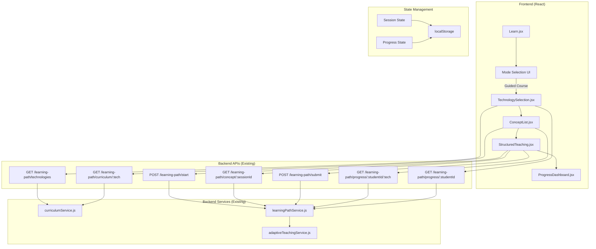

# Design Document: Structured Learning Path

## Overview

The Structured Learning Path feature adds a guided, curriculum-based learning mode to MicroTrainer's existing free-form "Ask Anything" chat interface. This feature enables students to follow predefined learning paths for various technologies (JavaScript, Python, Java, Django, React, Node.js) with sequential concept progression, adaptive teaching, and comprehension-based advancement.

**Key Design Principles:**
- **Backend-First Architecture**: All backend services, APIs, and curriculum data are already implemented and tested
- **Frontend Integration**: Design focuses on creating React components that consume existing backend APIs
- **Adaptive Teaching Integration**: Leverages the existing Adaptive Teaching System for content delivery
- **Progressive Enhancement**: Adds structured learning without disrupting the existing "Ask Anything" mode
- **Consistent UI/UX**: Maintains the white background aesthetic and design patterns from existing pages

**Scope:**
- Frontend components for technology selection, concept navigation, teaching interface, and progress tracking
- State management for learning sessions and progress
- UI/UX for sequential learning enforcement and progress visualization
- Integration with existing backend APIs (7 endpoints already implemented)

**Out of Scope:**
- Backend API development (already complete)
- Curriculum content creation (already complete with 5 concepts per technology)
- Adaptive teaching logic (already implemented in adaptiveTeachingService)
- Assessment algorithms (already implemented in learningPathService)

## Architecture

### System Architecture



### Component Hierarchy

```
Learn.jsx (Updated)
├── Header (Existing)
├── Mode Selection UI (New)
│   ├── "Ask Anything" Button
│   └── "Guided Course" Button
├── Ask Anything Mode (Existing)
│   └── [Current chat interface]
└── Guided Course Mode (New)
    ├── TechnologySelection.jsx
    │   ├── Technology Cards
    │   └── Progress Indicators
    ├── ConceptList.jsx
    │   ├── Concept Items (Completed/Current/Locked)
    │   └── Progress Bar
    ├── StructuredTeaching.jsx
    │   ├── Concept Header
    │   ├── Progress Indicator
    │   ├── Chat Interface
    │   └── Assessment Feedback
    └── ProgressDashboard.jsx
        ├── Technology Overview Cards
        ├── Completion Statistics
        └── Mastery Scores
```

### Data Flow

**1. Technology Selection Flow:**
```
User clicks "Guided Course"
  → Fetch available technologies (GET /learning-path/technologies)
  → Fetch student progress (GET /learning-path/progress/:studentId)
  → Display technologies with progress indicators
  → User selects technology
  → Navigate to ConceptList
```

**2. Concept Learning Flow:**
```
User selects current concept
  → Start learning session (POST /learning-path/start)
  → Receive sessionId and current concept order
  → Fetch concept teaching content (GET /learning-path/concept/:sessionId)
  → Display teaching content (adapted to student level)
  → Present cross-questions
  → User submits answers
  → Submit for assessment (POST /learning-path/submit)
  → Receive assessment result (passed/failed, percentage)
  → If passed: unlock next concept, update progress
  → If failed: re-teach with different approach
```

**3. Progress Tracking Flow:**
```
On component mount
  → Fetch student progress (GET /learning-path/progress/:studentId/:technology)
  → Update local state with completed concepts, current concept, scores
  → Display visual indicators (✅ completed, 🔵 current, 🔒 locked)
  → Calculate and display overall progress percentage
```

## Components and Interfaces

### 1. Learn.jsx (Updated)

**Purpose:** Main learning page with mode selection between "Ask Anything" and "Guided Course"

**State:**
```javascript
{
  learningMode: 'ask-anything' | 'guided-course',
  // Existing state for Ask Anything mode
  concept: string,
  conversation: Array,
  isLoading: boolean,
  sessionId: string,
  currentLevel: string,
  awaitingAnswer: boolean,
  studentId: string
}
```

**New UI Elements:**
- Mode selection buttons (shown when conversation is empty)
- Conditional rendering based on `learningMode`

**Behavior:**
- Default mode: "Ask Anything" (existing behavior)
- When "Guided Course" selected: render TechnologySelection component
- Persist selected mode in localStorage
- Allow switching between modes (with confirmation if session active)

### 2. TechnologySelection.jsx (New)

**Purpose:** Display available technologies with progress indicators

**Props:**
```javascript
{
  studentId: string,
  onTechnologySelect: (technology: string) => void
}
```

**State:**
```javascript
{
  technologies: Array<{
    id: string,
    name: string,
    totalConcepts: number
  }>,
  studentProgress: Object<{
    [techId]: {
      completedConcepts: number,
      currentConceptOrder: number,
      overallProgress: number
    }
  }>,
  isLoading: boolean
}
```

**API Calls:**
- `GET /learning-path/technologies` - Fetch available technologies
- `GET /learning-path/progress/:studentId` - Fetch student's progress across all technologies

**UI Layout:**
```
┌─────────────────────────────────────────┐
│  Choose Your Learning Path              │
│  Select a technology to start learning  │
├─────────────────────────────────────────┤
│  ┌──────────────┐  ┌──────────────┐    │
│  │ 🟨 JavaScript│  │ 🐍 Python    │    │
│  │ Progress: 40%│  │ Progress: 0% │    │
│  │ 2/5 concepts │  │ 0/5 concepts │    │
│  └──────────────┘  └──────────────┘    │
│  ┌──────────────┐  ┌──────────────┐    │
│  │ ☕ Java      │  │ ⚛️ React     │    │
│  │ Progress: 0% │  │ Progress: 0% │    │
│  │ 0/5 concepts │  │ 0/5 concepts │    │
│  └──────────────┘  └──────────────┘    │
└─────────────────────────────────────────┘
```

**Visual Indicators:**
- Progress bar showing completion percentage
- Badge showing completed/total concepts
- Different styling for: not started, in progress, completed
- Hover effects and animations (framer-motion)

### 3. ConceptList.jsx (New)

**Purpose:** Display ordered list of concepts with completion status

**Props:**
```javascript
{
  technology: string,
  studentId: string,
  onConceptSelect: (conceptId: string, order: number) => void,
  onBack: () => void
}
```

**State:**
```javascript
{
  curriculum: {
    technology: string,
    totalConcepts: number,
    concepts: Array<{
      id: string,
      order: number,
      title: string,
      description: string,
      objectives: Array<string>
    }>
  },
  progress: {
    currentConceptOrder: number,
    completedConcepts: Array<string>,
    conceptScores: Object<{ [conceptId]: number }>,
    overallProgress: number
  },
  isLoading: boolean
}
```

**API Calls:**
- `GET /learning-path/curriculum/:technology` - Fetch curriculum
- `GET /learning-path/progress/:studentId/:technology` - Fetch progress

**UI Layout:**
```
┌─────────────────────────────────────────┐
│  ← Back to Technologies                 │
│  JavaScript Course                      │
│  Progress: 40% (2/5 concepts)           │
│  ▓▓▓▓▓▓▓▓░░░░░░░░░░░                   │
├─────────────────────────────────────────┤
│  ✅ 1. Variables and Data Types         │
│     Score: 85%                          │
│     [Review]                            │
├─────────────────────────────────────────┤
│  ✅ 2. Functions                        │
│     Score: 92%                          │
│     [Review]                            │
├─────────────────────────────────────────┤
│  🔵 3. Arrays and Array Methods         │
│     Current concept - Start learning    │
│     [Start]                             │
├─────────────────────────────────────────┤
│  🔒 4. Objects and Object Methods       │
│     Complete previous concepts first    │
├─────────────────────────────────────────┤
│  🔒 5. Conditional Statements           │
│     Complete previous concepts first    │
└─────────────────────────────────────────┘
```

**Visual States:**
- **Completed (✅)**: Green background, shows score, "Review" button enabled
- **Current (🔵)**: Blue border, highlighted, "Start" button enabled
- **Locked (🔒)**: Gray background, disabled, shows lock message

**Behavior:**
- Click completed concept: navigate to review mode (read-only teaching content)
- Click current concept: start teaching session
- Click locked concept: show tooltip explaining sequential requirement

### 4. StructuredTeaching.jsx (New)

**Purpose:** Teaching interface for a specific concept with assessment

**Props:**
```javascript
{
  technology: string,
  conceptOrder: number,
  studentId: string,
  studentLevel: string,
  onComplete: () => void,
  onBack: () => void
}
```

**State:**
```javascript
{
  sessionId: string,
  conceptData: {
    title: string,
    description: string,
    objectives: Array<string>,
    content: string,
    crossQuestions: Array<string>,
    conceptOrder: number
  },
  conversation: Array<{
    role: 'user' | 'assistant' | 'system',
    content: string,
    timestamp: string
  }>,
  currentQuestionIndex: number,
  answers: Array<string>,
  assessmentResult: {
    passed: boolean,
    percentage: number,
    message: string
  } | null,
  isLoading: boolean,
  isAssessing: boolean
}
```

**API Calls:**
- `POST /learning-path/start` - Start learning session
- `GET /learning-path/concept/:sessionId` - Fetch teaching content
- `POST /learning-path/submit` - Submit answers for assessment

**UI Layout:**
```
┌─────────────────────────────────────────┐
│  ← Back to Concepts                     │
│  Concept 3/5: Arrays and Array Methods  │
│  ▓▓▓▓▓▓▓▓▓▓▓▓░░░░░░░░                  │
├─────────────────────────────────────────┤
│  [Teaching Content Area]                │
│                                         │
│  📚 Teaching at Beginner level          │
│                                         │
│  Arrays are lists that can store        │
│  multiple values. You can add, remove,  │
│  and access items using methods.        │
│                                         │
│  Example:                               │
│  const fruits = ['apple', 'banana'];    │
│  fruits.push('orange');                 │
│                                         │
├─────────────────────────────────────────┤
│  💭 Quick check:                        │
│  How do you add an item to the end of   │
│  an array?                              │
├─────────────────────────────────────────┤
│  [User Answer Input]                    │
│  ┌───────────────────────────────────┐ │
│  │ Type your answer...            [→]│ │
│  └───────────────────────────────────┘ │
└─────────────────────────────────────────┘
```

**Teaching Flow:**
1. Display teaching content (adapted to student level)
2. Present cross-questions one at a time
3. Collect user answers
4. After all questions answered, submit for assessment
5. Display assessment result:
   - **Passed (≥60%)**: Show success message, unlock next concept, navigate back to ConceptList
   - **Failed (<60%)**: Show encouragement, re-teach with different approach, ask different questions

**Assessment Feedback UI:**
```
┌─────────────────────────────────────────┐
│  Assessment Result                      │
├─────────────────────────────────────────┤
│  ✅ Great job! You scored 85%           │
│                                         │
│  You've understood this concept well.   │
│  Moving to the next concept.            │
│                                         │
│  [Continue to Next Concept]             │
└─────────────────────────────────────────┘

OR

┌─────────────────────────────────────────┐
│  Assessment Result                      │
├─────────────────────────────────────────┤
│  📚 You scored 45%                      │
│                                         │
│  Let me explain this concept            │
│  differently to help you understand     │
│  better.                                │
│                                         │
│  [Re-teaching content appears below]    │
└─────────────────────────────────────────┘
```

**Behavior:**
- Auto-scroll to latest message
- Disable input during loading/assessment
- Show typing indicator during AI response
- Persist conversation in session state
- Clear session on successful completion

### 5. ProgressDashboard.jsx (New)

**Purpose:** Overview of student's progress across all technologies

**Props:**
```javascript
{
  studentId: string
}
```

**State:**
```javascript
{
  allProgress: Object<{
    [technology]: {
      currentConceptOrder: number,
      completedConcepts: Array<string>,
      conceptScores: Object<{ [conceptId]: number }>,
      overallProgress: number
    }
  }>,
  technologies: Array<{
    id: string,
    name: string,
    totalConcepts: number
  }>,
  statistics: {
    totalCoursesStarted: number,
    totalCoursesCompleted: number,
    totalConceptsCompleted: number,
    averageScore: number
  },
  isLoading: boolean
}
```

**API Calls:**
- `GET /learning-path/progress/:studentId` - Fetch all progress
- `GET /learning-path/technologies` - Fetch technology list

**UI Layout:**
```
┌─────────────────────────────────────────┐
│  Your Learning Progress                 │
├─────────────────────────────────────────┤
│  📊 Statistics                          │
│  Courses Started: 3                     │
│  Courses Completed: 0                   │
│  Concepts Completed: 5                  │
│  Average Score: 87%                     │
├─────────────────────────────────────────┤
│  📚 JavaScript                          │
│  ▓▓▓▓▓▓▓▓░░░░░░░░░░░  40% (2/5)       │
│  Last studied: 2 hours ago              │
│  [Continue]                             │
├─────────────────────────────────────────┤
│  🐍 Python                              │
│  ▓▓▓▓▓▓▓▓▓▓▓▓▓▓▓▓▓▓▓▓  100% (5/5) ✅   │
│  Completed: Yesterday                   │
│  Average Score: 92%                     │
│  [Review]                               │
├─────────────────────────────────────────┤
│  ☕ Java                                │
│  ░░░░░░░░░░░░░░░░░░░░  0% (0/5)        │
│  Not started                            │
│  [Start]                                │
└─────────────────────────────────────────┘
```

**Features:**
- Summary statistics at the top
- Technology cards with progress bars
- Quick action buttons (Continue/Review/Start)
- Completion badges for finished courses
- Last activity timestamps

## Data Models

### Frontend State Models

**1. Technology Model:**
```typescript
interface Technology {
  id: string;              // e.g., "javascript"
  name: string;            // e.g., "JavaScript"
  totalConcepts: number;   // e.g., 25
}
```

**2. Curriculum Model:**
```typescript
interface Curriculum {
  technology: string;
  totalConcepts: number;
  concepts: Concept[];
}

interface Concept {
  id: string;              // e.g., "js-1"
  order: number;           // e.g., 1
  title: string;           // e.g., "Variables and Data Types"
  description: string;
  objectives: string[];
  teachingContent: {
    beginner: string;
    intermediate: string;
    advanced: string;
  };
  crossQuestions: string[];
}
```

**3. Progress Model:**
```typescript
interface Progress {
  currentConceptOrder: number;
  completedConcepts: string[];  // Array of concept IDs
  conceptScores: {
    [conceptId: string]: number;  // Percentage score
  };
  overallProgress: number;  // Percentage
}
```

**4. Learning Session Model:**
```typescript
interface LearningSession {
  sessionId: string;
  studentId: string;
  technology: string;
  currentConceptOrder: number;
  conversationHistory: Message[];
  assessmentAttempts: number;
  createdAt: string;
}

interface Message {
  role: 'user' | 'assistant' | 'system';
  content: string;
  timestamp: string;
}
```

**5. Assessment Result Model:**
```typescript
interface AssessmentResult {
  passed: boolean;
  assessment: {
    score: number;
    maxScore: number;
    percentage: number;
  };
  message: string;
  nextConceptAvailable?: boolean;
  reteachRequired?: boolean;
}
```

### Backend API Contracts (Already Implemented)

**1. GET /learning-path/technologies**
```typescript
Response: Technology[]
```

**2. GET /learning-path/curriculum/:technology**
```typescript
Response: Curriculum
```

**3. POST /learning-path/start**
```typescript
Request: {
  studentId: string;
  technology: string;
}
Response: {
  sessionId: string;
  technology: string;
  currentConceptOrder: number;
  progress: Progress;
}
```

**4. GET /learning-path/concept/:sessionId**
```typescript
Query: {
  studentLevel?: 'beginner' | 'intermediate' | 'advanced';
}
Response: {
  title: string;
  description: string;
  objectives: string[];
  content: string;  // Adapted to student level
  crossQuestions: string[];
  conceptOrder: number;
  sessionId: string;
}
```

**5. POST /learning-path/submit**
```typescript
Request: {
  sessionId: string;
  answers: string[];  // Array of student answers
}
Response: AssessmentResult
```

**6. GET /learning-path/progress/:studentId/:technology**
```typescript
Response: Progress
```

**7. GET /learning-path/progress/:studentId**
```typescript
Response: {
  [technology: string]: Progress;
}
```

## Error Handling

### Frontend Error Handling

**1. API Error Handling:**
```javascript
try {
  const response = await axios.get(`${API_URL}/learning-path/technologies`);
  setTechnologies(response.data);
} catch (error) {
  if (error.response?.status === 404) {
    showError("Technology not found");
  } else if (error.response?.status === 500) {
    showError("Server error. Please try again later.");
  } else {
    showError("Network error. Check your connection.");
  }
}
```

**2. Session Expiration:**
- Detect invalid sessionId errors
- Clear local session state
- Prompt user to restart learning session
- Preserve progress data

**3. Network Failures:**
- Show retry button
- Cache last successful state
- Allow offline review of completed concepts
- Queue submissions for retry

**4. Invalid State Handling:**
- Validate concept order before navigation
- Prevent access to locked concepts
- Handle missing progress data gracefully
- Redirect to technology selection if curriculum not found

### User-Facing Error Messages

**Error Scenarios:**
1. **Technology not found:** "This technology is not available yet. Please choose another."
2. **Session expired:** "Your session has expired. Let's start fresh!"
3. **Network error:** "Connection lost. Please check your internet and try again."
4. **Assessment failed:** "You scored X%. Let me explain this differently..." (not an error, part of flow)
5. **Invalid concept access:** "Complete the previous concepts first to unlock this one."

### Error Recovery Strategies

**1. Automatic Recovery:**
- Retry failed API calls (max 3 attempts)
- Restore session from localStorage
- Sync progress on reconnection

**2. Manual Recovery:**
- "Try Again" buttons on error states
- "Start Over" option for corrupted sessions
- "Contact Support" link for persistent issues

**3. Graceful Degradation:**
- Show cached data when offline
- Allow review mode without network
- Disable submission features when offline

## Testing Strategy

### Unit Testing

**Component Tests (React Testing Library + Jest):**

1. **TechnologySelection.jsx:**
   - Renders technology cards correctly
   - Displays progress indicators accurately
   - Handles technology selection click
   - Shows loading state during API calls
   - Handles empty progress data
   - Displays error messages appropriately

2. **ConceptList.jsx:**
   - Renders concepts in correct order
   - Shows correct visual indicators (✅🔵🔒)
   - Disables locked concepts
   - Enables current and completed concepts
   - Calculates progress percentage correctly
   - Handles back navigation

3. **StructuredTeaching.jsx:**
   - Displays teaching content correctly
   - Shows cross-questions sequentially
   - Collects user answers
   - Submits assessment correctly
   - Displays assessment results
   - Handles re-teaching flow
   - Manages conversation history

4. **ProgressDashboard.jsx:**
   - Calculates statistics correctly
   - Renders progress bars accurately
   - Shows completion badges
   - Handles empty progress state
   - Formats timestamps correctly

5. **Learn.jsx (Updated):**
   - Switches between modes correctly
   - Persists mode selection
   - Renders correct component based on mode
   - Maintains existing "Ask Anything" functionality

**API Integration Tests:**
- Mock axios calls
- Test success responses
- Test error responses
- Test loading states
- Test data transformation

**State Management Tests:**
- Test localStorage persistence
- Test state updates
- Test session management
- Test progress synchronization

### Integration Testing

**User Flow Tests:**

1. **Complete Learning Path Flow:**
   - Select "Guided Course" mode
   - Choose a technology
   - View concept list
   - Start learning a concept
   - Answer cross-questions
   - Pass assessment (≥60%)
   - Verify next concept unlocked
   - Complete all concepts
   - View completion status

2. **Re-teaching Flow:**
   - Start a concept
   - Answer cross-questions poorly
   - Fail assessment (<60%)
   - Receive re-teaching content
   - Answer new cross-questions
   - Pass assessment
   - Verify progress updated

3. **Progress Persistence Flow:**
   - Complete some concepts
   - Close browser
   - Reopen application
   - Verify progress restored
   - Continue from last concept

4. **Mode Switching Flow:**
   - Start in "Ask Anything" mode
   - Switch to "Guided Course"
   - Complete a concept
   - Switch back to "Ask Anything"
   - Verify both modes work independently

**Cross-Browser Testing:**
- Chrome, Firefox, Safari, Edge
- Mobile browsers (iOS Safari, Chrome Mobile)
- Test responsive layouts
- Test touch interactions

### End-to-End Testing (Cypress/Playwright)

**Critical User Journeys:**

1. **New Student Journey:**
   ```
   Visit /learn
   → Click "Guided Course"
   → See all technologies with 0% progress
   → Select JavaScript
   → See concept list with first concept unlocked
   → Click "Start" on first concept
   → Read teaching content
   → Answer 3 cross-questions
   → Pass assessment
   → See success message
   → Return to concept list
   → Verify first concept marked complete
   → Verify second concept unlocked
   ```

2. **Returning Student Journey:**
   ```
   Visit /learn with existing progress
   → Click "Guided Course"
   → See technologies with progress indicators
   → Select in-progress technology
   → See completed concepts marked ✅
   → See current concept highlighted 🔵
   → Click "Review" on completed concept
   → See read-only teaching content
   → Return to concept list
   → Click "Start" on current concept
   → Continue learning
   ```

3. **Failed Assessment Journey:**
   ```
   Start a concept
   → Answer cross-questions poorly
   → Submit assessment
   → See "You scored 45%" message
   → See re-teaching content
   → Answer new cross-questions
   → Submit assessment
   → Pass with 70%
   → Verify concept marked complete
   ```

### Performance Testing

**Metrics to Monitor:**
- Initial page load time (<2s)
- API response times (<500ms)
- Component render times (<100ms)
- Smooth animations (60fps)
- Memory usage (no leaks)

**Load Testing:**
- Test with large curriculum (25+ concepts)
- Test with extensive conversation history
- Test with multiple concurrent sessions
- Test localStorage limits

### Accessibility Testing

**WCAG 2.1 AA Compliance:**
- Keyboard navigation (Tab, Enter, Escape)
- Screen reader compatibility (ARIA labels)
- Color contrast ratios (4.5:1 minimum)
- Focus indicators visible
- Error messages announced
- Progress updates announced

**Manual Testing:**
- Test with screen readers (NVDA, JAWS, VoiceOver)
- Test keyboard-only navigation
- Test with browser zoom (200%)
- Test with high contrast mode

### Manual Testing Checklist

**UI/UX Verification:**
- [ ] All buttons have hover states
- [ ] Loading states are clear
- [ ] Error messages are helpful
- [ ] Success feedback is encouraging
- [ ] Progress indicators are accurate
- [ ] Animations are smooth
- [ ] Layout is responsive
- [ ] Text is readable
- [ ] Icons are meaningful
- [ ] Colors match design system

**Functional Verification:**
- [ ] Mode switching works
- [ ] Technology selection works
- [ ] Concept navigation works
- [ ] Teaching content displays correctly
- [ ] Cross-questions appear sequentially
- [ ] Assessment submission works
- [ ] Re-teaching triggers correctly
- [ ] Progress updates correctly
- [ ] localStorage persists data
- [ ] Back navigation works

## Implementation Notes

### Phase 1: Core Components (Week 1)

**Priority 1: Mode Selection & Technology Selection**
1. Update Learn.jsx with mode selection UI
2. Create TechnologySelection.jsx component
3. Implement API integration for technologies and progress
4. Add localStorage for mode persistence
5. Test mode switching and technology selection

**Priority 2: Concept List**
1. Create ConceptList.jsx component
2. Implement curriculum fetching
3. Add visual indicators for concept states
4. Implement navigation to teaching interface
5. Test concept locking logic

### Phase 2: Teaching Interface (Week 2)

**Priority 1: Basic Teaching Flow**
1. Create StructuredTeaching.jsx component
2. Implement session start API call
3. Display teaching content
4. Implement cross-question flow
5. Add answer collection

**Priority 2: Assessment & Re-teaching**
1. Implement assessment submission
2. Display assessment results
3. Handle pass/fail scenarios
4. Implement re-teaching flow
5. Test complete learning cycle

### Phase 3: Progress & Polish (Week 3)

**Priority 1: Progress Dashboard**
1. Create ProgressDashboard.jsx component
2. Implement statistics calculation
3. Add progress visualization
4. Implement quick actions
5. Test with various progress states

**Priority 2: Polish & Testing**
1. Add animations and transitions
2. Improve error handling
3. Add loading skeletons
4. Optimize performance
5. Conduct accessibility audit
6. Fix bugs and edge cases

### Technical Considerations

**State Management:**
- Use React Context for global state (studentId, currentMode)
- Use component state for local UI state
- Use localStorage for persistence
- Consider Redux if state becomes complex

**API Client:**
```javascript
// api/learningPath.js
import axios from 'axios';

const API_URL = import.meta.env.VITE_API_URL || 'http://localhost:5000';

export const learningPathAPI = {
  getTechnologies: () => 
    axios.get(`${API_URL}/learning-path/technologies`),
  
  getCurriculum: (technology) => 
    axios.get(`${API_URL}/learning-path/curriculum/${technology}`),
  
  startSession: (studentId, technology) => 
    axios.post(`${API_URL}/learning-path/start`, { studentId, technology }),
  
  getConcept: (sessionId, studentLevel) => 
    axios.get(`${API_URL}/learning-path/concept/${sessionId}`, {
      params: { studentLevel }
    }),
  
  submitAnswers: (sessionId, answers) => 
    axios.post(`${API_URL}/learning-path/submit`, { sessionId, answers }),
  
  getProgress: (studentId, technology) => 
    axios.get(`${API_URL}/learning-path/progress/${studentId}/${technology}`),
  
  getAllProgress: (studentId) => 
    axios.get(`${API_URL}/learning-path/progress/${studentId}`)
};
```

**Routing:**
```javascript
// App.jsx or router configuration
<Route path="/learn" element={<Learn />} />
// No additional routes needed - all navigation handled within Learn.jsx
```

**Styling Approach:**
- Use Tailwind CSS (consistent with existing pages)
- Use framer-motion for animations
- Maintain white background theme
- Use existing color palette (blue primary, gray neutrals)

**Performance Optimizations:**
- Lazy load components (React.lazy)
- Memoize expensive calculations (useMemo)
- Debounce API calls
- Cache curriculum data
- Optimize re-renders (React.memo)

### Integration with Existing Systems

**Adaptive Teaching System:**
- Pass student level to concept API
- Use existing level detection logic
- Maintain level consistency across modes
- Share level state between "Ask Anything" and "Guided Course"

**Student Profile:**
- Use same studentId from localStorage
- Track learning path progress separately
- Consider adding learning path stats to profile
- Future: integrate with certificate/badge system

**Header Component:**
- Reuse existing Header.jsx
- Show level badge in both modes
- Maintain consistent navigation

### Future Enhancements (Out of Scope)

1. **Certificates & Badges:**
   - Award certificates on course completion
   - Display badges on profile
   - Share achievements on social media

2. **Spaced Repetition:**
   - Review completed concepts periodically
   - Adaptive review scheduling
   - Retention tracking

3. **Collaborative Learning:**
   - Study groups
   - Peer discussions
   - Shared progress

4. **Advanced Analytics:**
   - Time spent per concept
   - Learning velocity
   - Difficulty predictions
   - Personalized recommendations

5. **Mobile App:**
   - Native iOS/Android apps
   - Offline learning
   - Push notifications for reviews

6. **Gamification:**
   - Streaks and daily goals
   - Leaderboards
   - Points and rewards
   - Challenges and competitions

## Conclusion

This design document provides a comprehensive blueprint for implementing the Structured Learning Path feature. The frontend components will integrate seamlessly with the existing backend APIs, maintaining consistency with MicroTrainer's design language while adding powerful new learning capabilities.

**Key Success Factors:**
- Leverage existing backend infrastructure (no backend changes needed)
- Maintain UI/UX consistency with existing pages
- Ensure smooth integration with Adaptive Teaching System
- Provide clear visual feedback for progress and assessment
- Handle errors gracefully with helpful messages
- Optimize for performance and accessibility

**Next Steps:**
1. Review and approve this design document
2. Create detailed task breakdown
3. Begin Phase 1 implementation
4. Conduct iterative testing and refinement
5. Deploy to production with feature flag
6. Gather user feedback and iterate
